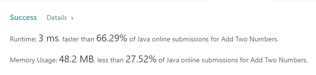

# В данном репозитории будут храниться задачи на алгоритмы с сайта LeetCode

+ ### 02.05.2022 [Add Two Numbers](https://leetcode.com/problems/add-two-numbers/ "описание задачи")

+ ### 02.05.2022 [Sort Array By Parity](https://leetcode.com/problems/sort-array-by-parity/ "описание задачи")

+ ### 09.05.2022 [Longest Substring Without Repeating Characters](https://leetcode.com/problems/longest-substring-without-repeating-characters/ "описание задачи")

